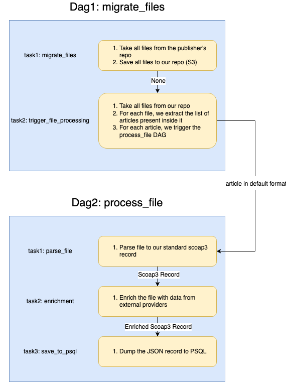

[](https://codecov.io/gh/cern-sis/workflows)

# Workflows

The following image describes the process for each publishers. Please note that the number of tasks is the minimum, more tasks can be implemented if the need raises.



## Run with docker-compose

The easiest way to run the project is run in with docker compose.
For it docker-compose has to be installed.After just run in it the command bellow:

```
docker-compose up --build
```

Currently the docker-compose performance isn't very good. Thus, for local dev, it is advised to run it locally.

## Run it locally

We need to install airflow.

1. First, we need to install poetry:

   ```
   curl -sSL https://install.python-poetry.org | python3 -

   ```

2. Install pyenv, the instruction can be found [here](https://github.com/pyenv/pyenv#installation)
3. Export correct python version by using pyenv:
   ```
   export PYTHON_VERSION = 3.10.11
   pyenv install ${PYTHON_VERSION}
   pyenv global $(PYTHON_VERSION)
   ```
4. Set airflow home directory:

   ```
   export AIRFLOW_HOME=${PWD}
   ```

5. Install dependencies listed in pyproject.toml file by running the command:
   ```
   poetry install
   ```
6. Run Airflow. Airflow comes with the `standalone` command. This should not be used as it seems to use the SequentialExecutor by default. To have our local config being use, we must run all services together :

   ```
       poetry run airflow webserver
       poetry run airflow triggerer
       poetry run airflow scheduler
   ```

### Script

A Makefile has been created to ease this process. The available targets are the following :

- `make init` : Inits the pyenv version and virtual env.
- `make start` : Starts all processes needed.
- `make stop` : Stops all processes needed.
- `make create_user` : create a new user with all the parameters

## Access UI

Airflow UI will be rinning on localhost:8080.
More details about Airflow installation and running can be found [here](https://airflow.apache.org/docs/apache-airflow/stable/start/local.html)

## Environment Variables

### Publisher Specific

| Name                      | Description                                                | Affected Publishers |
| ------------------------- | ---------------------------------------------------------- | ------------------- |
| {PUBLISHER}\_API_BASE_URL | Base URL for the API to call to get the articles metadata. | APS                 |
| {PUBLISHER}\_BUCKET_NAME  | S3 Bucket name                                             | APS                 |
| {PUBLISHER}\_FTP_HOST     | FTP Host                                                   | Springer            |
| {PUBLISHER}\_FTP_USERNAME | FTP Username                                               | Springer            |
| {PUBLISHER}\_FTP_PASSWORD | FTP Password                                               | Springer            |
| {PUBLISHER}\_FTP_PORT     | FTP Port                                                   | Springer            |
| {PUBLISHER}\_FTP_DIR      | FTP Base directory                                         | Springer            |

### Global

| Name        | Description                     |
| ----------- | ------------------------------- |
| REPO_URL    | URL for the SCOAP3 repo schema. |
| S3_ENDPOINT | Endpoint of the S3 server.      |
| S3_USERNAME | Username of the S3 server.      |
| S3_PASSWORD | Password of the S3 server.      |
| S3_REGION   | Username of the S3 server.      |
