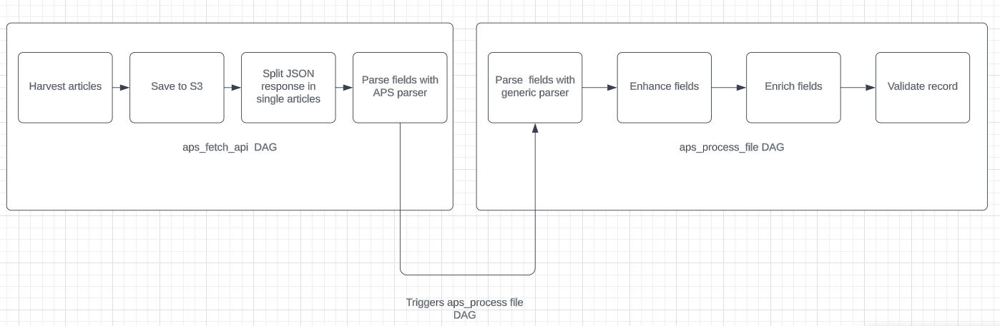

# APS data processing flow

# Final fields

| Field                | Reference                                                    | Subfields      | Subsubfields |
| -------------------- | ------------------------------------------------------------ | -------------- | ------------ |
| dois                 | [Generic parsing](#generic_parsing) : <a href="#64">[64]</a> | value          |              |
| page_nr              | [Parsing](#parsing) : <a href="#3">[3]</a>                   |                |              |
| arxiv_eprints        | [Enricher](#enricher) : <a href="#33">[33]</a>               | value          |              |
|                      |                                                              | categories     |              |
| authors              | [Parsing](#parsing) : <a href="#7">[7]</a>                   | full_name      |              |
|                      |                                                              | given_names    |              |
|                      |                                                              | surname        |              |
|                      |                                                              | value          |              |
|                      |                                                              | organization   |              |
|                      |                                                              | country        |              |
| license              | [Parsing](#parsing) : <a href="#14">[14]</a>                 | url            |              |
|                      |                                                              | license        |              |
| publication_info     | [Generic parsing](#generic_parsing) : <a href="#63">[63]</a> | journal_title  |              |
|                      |                                                              | journal_volume |              |
|                      |                                                              | year           |              |
|                      |                                                              | journal_issue  |              |
|                      |                                                              | material       |              |
| abstracts            | [Enhancer](#enhancer) : <a href="#38">[38]</a>               | value          |              |
| acquisition_source   | [Enhancer](#enhancer) : <a href="#38">[38]</a>               | source         |              |
|                      |                                                              | method         |              |
|                      |                                                              | date           |              |
| copyright            | [Enhancer](#enhancer) : <a href="#40">[40]</a>               | holder         |              |
|                      |                                                              | year           |              |
|                      |                                                              | statement      |              |
| imprints             | [Enhancer](#enhancer) : <a href="#41">[41]</a>               | date           |              |
|                      |                                                              | publisher      |              |
| record_creation_date | [Enhancer](#enhancer) : <a href="#42">[42]</a>               |                |              |
| titles               | [Enhancer](#enhancer) : <a href="#43">[43]</a>               | title          |              |
|                      |                                                              | subtitle       |              |
| $schema              | [Enricher](#enricher) : <a href="#32">[32]</a>               |                |              |

# [Enricher](#enricher):

| Reference                      | Field         | Enricher                                   |
| ------------------------------ | ------------- | ------------------------------------------ |
| <a href="#32" id="32">[32]</a> | schema        | [\_get_schema](#_get_schema)               |
| <a href="#33" id="33">[33]</a> | arxiv_eprints | [\_get_arxiv_eprints](#_get_arxiv_eprints) |

### [\_get_schema](#_get_schema)

| Reference                      | Field | Value                                                                 |
| ------------------------------ | ----- | --------------------------------------------------------------------- |
| <a href="#33" id="33">[33]</a> |       | `os.getenv("REPO_URL", "http://repo.qa.scoap3.org/schemas/hep.json")` |

### [\_get_arxiv_eprints](#_get_arxiv_eprints)

| Reference                      | Field      | Processing                                       |
| ------------------------------ | ---------- | ------------------------------------------------ |
| <a href="#34" id="34">[34]</a> | categories | [\_get_arxiv_categories](#_get_arxiv_categories) |
| <a href="#35" id="35">[35]</a> | value      | [\_clean_arxiv](#_clean_arxiv)                   |

### [\_get_arxiv_categories](#_get_arxiv_categories)

| Reference                      | Field | Processing                                                                                                                                                                                                                                                                                                                                                                                                       |
| ------------------------------ | ----- | ---------------------------------------------------------------------------------------------------------------------------------------------------------------------------------------------------------------------------------------------------------------------------------------------------------------------------------------------------------------------------------------------------------------- |
| <a href="#36" id="36">[36]</a> |       | 1. Need to take arxiv id value from arxiv_eprints.value   2. Make a request to arxiv API: `f'http://export.arxiv.org/api/query?if:{ arxiv_eprints.value}'`   3. From XML response, take the categories by path: `arxiv:primary_category` and rest of the categories by path: `/w3:category.`   `xml_namespaces = { "arxiv": "http://arxiv.org/schemas/atom", "w3": "http://www.w3.org/2005/Atom", }` |

### [\_clean_arxiv](#_clean_arxiv)

| Reference                      | Field | Proccessing                                   |
| ------------------------------ | ----- | --------------------------------------------- |
| <a href="#37" id="37">[37]</a> |       | `re.search(r"\d{4}\.\d{4,5}", arxiv).group()` |

# [Enhancer](#enhancer)

| Reference                      | Field                | Enhancer                                                                |
| ------------------------------ | -------------------- | ----------------------------------------------------------------------- |
| <a href="#38" id="38">[38]</a> | abstracts            | [\_\_construct_abstracts](#__construct_abstracts)                       |
| <a href="#39" id="39">[39]</a> | acquisition_source   | [\_\_construct_acquisition_source](#__construct_acquisition_source)     |
| <a href="#40" id="40">[40]</a> | copyright            | [\_\_construct_copyright](#__construct_copyright)                       |
| <a href="#41" id="41">[41]</a> | imprints             | [\_\_construct_imprints](#__construct_imprints)                         |
| <a href="#42" id="42">[42]</a> | record_creation_date | [\_\_construct_record_creation_date](#__construct_record_creation_date) |
| <a href="#43" id="43">[43]</a> | titles               | [\_\_construct_titles](#__construct_titles)                             |
| <a href="#44" id="44">[44]</a> | country              | [\_\_remove_country](#__remove_country)                                 |

### [\_\_construct_abstracts](#__construct_abstracts)

| Reference                      | Field  | Value                                           |
| ------------------------------ | ------ | ----------------------------------------------- |
| <a href="#45" id="45">[45]</a> | value  | [Parsing](#parsing) <a href="#5" id="5">[5]</a> |
| <a href="#47" id="47">[47]</a> | source | constant: APS                                   |

### [\_\_construct_acquisition_source](#__construct_acquisition_source)

| Reference                      | Field  | Value                                 |
| ------------------------------ | ------ | ------------------------------------- |
| <a href="#47" id="47">[47]</a> | source | constant: APS                         |
| <a href="#48" id="48">[48]</a> | method | constant: APS                         |
| <a href="#49" id="49">[49]</a> | date   | `datetime.datetime.now().isoformat()` |

### [\_\_construct_copyright](#__construct_copyright)

| Reference                      | Field     | Value                                      | Default value |
| ------------------------------ | --------- | ------------------------------------------ | ------------- |
| <a href="#50" id="50">[50]</a> | holder    | [Parsing](#parsing) <a href="#61">[61]</a> | ""            |
| <a href="#51" id="51">[51]</a> | year      | [Parsing](#parsing) <a href="#12">[12]</a> | ""            |
| <a href="#52" id="52">[52]</a> | statement | [Parsing](#parsing) <a href="#13">[13]</a> | ""            |

### [\_\_construct_imprints](#__construct_imprints)

| Reference                      | Field     | Value                                 | Default value |
| ------------------------------ | --------- | ------------------------------------- | ------------- |
| <a href="#54" id="54">[54]</a> | date      | `datetime.datetime.now().isoformat()` | ""            |
| <a href="#55" id="55">[55]</a> | publisher | constant: APS                         |               |

#### [\_\_construct_record_creation_date](#__construct_record_creation_date)

| Reference                      | Field                | Value                                 | Default value |
| ------------------------------ | -------------------- | ------------------------------------- | ------------- |
| <a href="#56" id="56">[56]</a> | record_creation_date | `datetime.datetime.now().isoformat()` |               |

### [\_\_construct_titles](#__construct_titles)

| Reference                      | Field    | Value                                        | Processing                                                                                                     | Default value |
| ------------------------------ | -------- | -------------------------------------------- | -------------------------------------------------------------------------------------------------------------- | ------------- |
| <a href="#57" id="57">[57]</a> | title    | from [parsed](#parsing) json value: title    | removed fn tags. `FN_REGEX = re.compile(r"<fn.*<\/fn>")` `FN_REGEX.sub("", item.pop("title", "")).strip()` | ""            |
| <a href="#58" id="58">[58]</a> | subtitle | from [parsed](#parsing) json value: subtitle |                                                                                                                | ""            |
| <a href="#59" id="59">[59]</a> | source   | constant: APS                                |                                                                                                                |               |

### [\_\_remove_country](#__remove_country)

| Reference                      | Field | Value                                                                    | Processing                                                                                                             |
| ------------------------------ | ----- | ------------------------------------------------------------------------ | ---------------------------------------------------------------------------------------------------------------------- |
| <a href="#60" id="60">[60]</a> |       | from [parsed](#parsing) json value: [affiliations](affiliations).country | remove the country from record author, who has "cooperation agreement with cern" in [affiliations](affiliations).value |

# [Generic parsing](#generic_parsing)

| Reference                      | Field            | Subfields                                                                   | Value                                                                                                                              | Default value |
| ------------------------------ | ---------------- | --------------------------------------------------------------------------- | ---------------------------------------------------------------------------------------------------------------------------------- | ------------- |
| <a href="#62" id="62">[62]</a> | authors          | given_names                                                                 | Takes given_names([authors_parsing](#authors_parsing) <a href="#19">[19]</a>)                                                      | ""            |
|                                | full_name        | Takes full_name([authors_parsing](#authors_parsing) <a href="#18">[18]</a>) | ""                                                                                                                                 |
| <a href="#63" id="63">[63]</a> | publication_info | journal_title                                                               | Takes journal_title([Parsing](#parsing) <a href="#8">[8]</a>)                                                                      | ""            |
|                                |                  | journal_volume                                                              | Takes journal_volume([Parsing](#parsing) <a href="#10">[10]</a>) ""                                                                |
|                                |                  | year                                                                        | Takes journal_year([Parsing](#parsing) <a href="#11">[11]</a>)""                                                                   |
|                                |                  | journal_issue                                                               | Takes journal_issue([Parsing](#parsing) <a href="#9">[9]</a>) ""                                                                   |
|                                |                  | material                                                                    | Takes journal_doctype([Parsing](#parsing) <a href="#2">[2]</a>) ""                                                                 |
| <a href="#64" id="64">[64]</a> | dois             | value                                                                       | Takes dois from([Parsing](#parsing) <a href="#1">[1]</a>) and puts every doi in dict `[{"value": doi} for doi in dois if doi]` | ""            |
|                                | journal_title    |                                                                             | REMOVED                                                                                                                            |               |
|                                | journal_volume   |                                                                             | REMOVED                                                                                                                            |               |
|                                | journal_year     |                                                                             | REMOVED                                                                                                                            |               |
|                                | journal_issue    |                                                                             | REMOVED                                                                                                                            |               |
|                                | journal_doctype  |                                                                             | REMOVED                                                                                                                            |               |

# [Parsing](#parsing)

| Reference                      | Field               | Source                                     | Parsing                                                                                                                                                                                                                                                                                                                                                                                                 |
| ------------------------------ | ------------------- | ------------------------------------------ | ------------------------------------------------------------------------------------------------------------------------------------------------------------------------------------------------------------------------------------------------------------------------------------------------------------------------------------------------------------------------------------------------------- |
| <a href="#1" id="1">[1]</a>    | dois                | identifiers.doi                            | `lambda x: [x]`                                                                                                                                                                                                                                                                                                                                                                                         |
| <a href="#2" id="2">[2]</a>    | journal_doctype     | articleType                                | `lambda x: article_type_mapping.get(x, "other")`  when  `article_type_mapping = {"article": "article","erratum": "erratum","editorial": "editorial","retraction": "retraction","essay": "other","comment": "other","letter-to-editor": "other","rapid": "other","brief": "other","reply": "other","announcement": "other","nobel": "other"}`                                                    |
| <a href="#3" id="3">[3]</a>    | page_nr             | numPages                                   | `lambda x: [x]`                                                                                                                                                                                                                                                                                                                                                                                         |
| <a href="#4" id="4">[4]</a>    | arxiv_eprints       | identifiers.arxiv                          | `lambda x: [{"value": re.sub("arxiv:", "", x, flags=re.IGNORECASE)}]`                                                                                                                                                                                                                                                                                                                                   |
| <a href="#5" id="5">[5]</a>    | abstract            | abstract.value                             |                                                                                                                                                                                                                                                                                                                                                                                                         |
| <a href="#6" id="6">[6]</a>    | title               | title.value                                |                                                                                                                                                                                                                                                                                                                                                                                                         |
| <a href="#7" id="7">[7]</a>    | authors             | authors                                    | <a href="#authors_parsing">authors_parsing</a> <a href="#18">[18]</a> <a href="#19">[19]</a> <a href="#20">[20]</a> <a href="#21">[21]</a>   After [Generic parsing](#generic_parsing)[62] forms fields from <a href="#authors_parsing">authors_parsing</a> <a href="#18">[18]</a> <a href="#19">[19]</a>   some countries are removed: <a href="#enhancer">Enhancer</a> <a href="#44">[44]</a> |
| <a href="#8" id="8">[8]</a>    | journal_title       | journal.name                               |                                                                                                                                                                                                                                                                                                                                                                                                         |
| <a href="#9" id="9">[9]</a>    | journal_issue       | issue.number                               |                                                                                                                                                                                                                                                                                                                                                                                                         |
| <a href="#10" id="10">[10]</a> | journal_volume      | volume.number                              |                                                                                                                                                                                                                                                                                                                                                                                                         |
| <a href="#11" id="11">[11]</a> | journal_year        | date                                       | `lambda x: int(x[:4] if (len(x) >= 4) else 0000)`                                                                                                                                                                                                                                                                                                                                                       |
| <a href="#12" id="12">[12]</a> | copyright_year      | rights.copyrightYear                       |                                                                                                                                                                                                                                                                                                                                                                                                         |
| <a href="#13" id="13">[13]</a> | copyright_statement | rights.rightsStatement                     |                                                                                                                                                                                                                                                                                                                                                                                                         |
| <a href="#14" id="14">[14]</a> | license             | rights.licenses                            | <a href="#license_parsing">license_parsing</a> <a href="#25">[25]</a> <a href="#26">[26]</a> <a href="#27">[27]</a>                                                                                                                                                                                                                                                                                     |
| <a href="#15" id="15">[15]</a> | collections         | constant: ["HEP", "Citeable", "Published"] |                                                                                                                                                                                                                                                                                                                                                                                                         |
| <a href="#16" id="16">[16]</a> | field_categories    |                                            |                                                                                                                                                                                                                                                                                                                                                                                                         |
| <a href="#17" id="17">[17]</a> | files               |                                            | <a href="#files_parsing">files_parsing</a> <a href="#28">[28]</a> <a href="#29">[29]</a> <a href="#30">[30]</a> <a href="#31">[31]</a>                                                                                                                                                                                                                                                                  |
| <a href="#61" id="61">[61]</a> | copyright_holder    | rights.copyrightHolders                    | `lambda x: x[0]["name"] if len(x) >= 1 else ""`                                                                                                                                                                                                                                                                                                                                                         |

### [authors_parsing](#authors_parsing)

| Reference                      | Field        | Source       | Parsing                                                                                                                                                                                                                  |
| ------------------------------ | ------------ | ------------ | ------------------------------------------------------------------------------------------------------------------------------------------------------------------------------------------------------------------------ |
| <a href="#18" id="18">[18]</a> | full_name    | name         |                                                                                                                                                                                                                          |
| <a href="#19" id="19">[19]</a> | given_names  | firstname    |                                                                                                                                                                                                                          |
| <a href="#20" id="20">[20]</a> | surname      | surname      |                                                                                                                                                                                                                          |
| <a href="#21" id="21">[21]</a> | affiliations | affiliations | takes the authors.affiliationIds, and looks an affiliation with the same value of affiliations.id: <a href="#affiliations">affiliations_parsing</a> <a href="#22">[22]</a> <a href="#23">[23]</a> <a href="#24">[24]</a> |

### [affiliations_parsing](#affiliations)

| Reference                      | Field        | Source           | Parsing                                           |
| ------------------------------ | ------------ | ---------------- | ------------------------------------------------- |
| <a href="#22" id="22">[22]</a> | value        | name             |                                                   |
| <a href="#23" id="23">[23]</a> | organization | affiliation.name | `(",").join(affiliation["name"].split(",")[:-1])` |
| <a href="#24" id="24">[24]</a> | country      | name             | `affiliation["name"].split(", ")[-1:][0]`         |

### [license_parsing](#license_parsing)

| Reference                      | Field  | Source                                   | Parsing              |
| ------------------------------ | ------ | ---------------------------------------- | -------------------- |
| <a href="#25" id="25">[25]</a> | term   | classificationSchemes.subjectAreas.label | or default value: "" |
| <a href="#26" id="26">[26]</a> | scheme |                                          | constant: APS        |
| <a href="#27" id="27">[27]</a> | source |                                          | ""                   |

### [files_parsing](#files_parsing)

| Reference                      | Field    | Source               | Value                                                           |
| ------------------------------ | -------- | -------------------- | --------------------------------------------------------------- |
| <a href="#28" id="28">[28]</a> | url      | doi: identifiers.doi | `"http://harvest.aps.org/v2/journals/articles/{0}".format(doi)` |
| <a href="#29" id="29">[29]</a> | headers  |                      | `{"Accept": "application/pdf"}`                                 |
| <a href="#30" id="30">[30]</a> | name     | doi: identifiers.doi | `"{0}.pdf".format(doi)`                                         |
| <a href="#31" id="31">[31]</a> | filetype |                      | constant: pdf                                                   |
