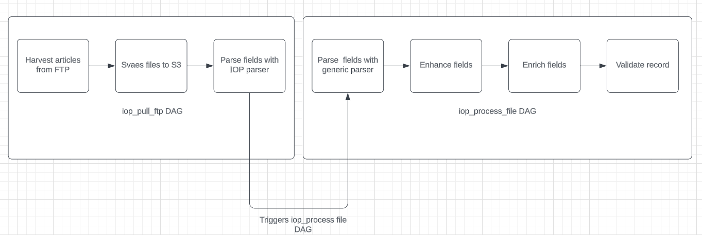

# [Final fields](#final_fields)

| Field                | Processed                                                                                                                          | Subfield       | Subsubfield |
| -------------------- | ---------------------------------------------------------------------------------------------------------------------------------- | -------------- | ----------- |
| dois                 | <a href="#generic_parsing">generic_parsing</a> : <a href="#41">[41]</a>                                                            | value          |             |
| arxiv_eprints        | <a href="#enricher">enricher</a> : <a href="#69">[69]</a>                                                                          | value          |             |
|                      |                                                                                                                                    | categories     |             |
| page_nr              | <a href="#parsing">parsing</a> : <a href="#5">[5]</a>                                                                              |                |             |
| authors              | <a href="#parsing">parsing</a> : <a href="#6">[6]</a>  <a href="#generic_parsing">generic_parsing</a> : <a href="#29">[29]</a> | surname        |             |
|                      |                                                                                                                                    | given_names    |             |
|                      |                                                                                                                                    | full_name      |             |
|                      |                                                                                                                                    | affiliations   | country     |
|                      |                                                                                                                                    |                | institution |
| collaborations       | <a href="#generic_parsing">generic_parsing</a> <a href="#31">[31]</a>                                                              | value          |             |
| license              | <a href="#parsing">parsing</a> <a href="#18">[18]</a>                                                                              | url            |             |
|                      |                                                                                                                                    | license        |             |
| publication_info     | <a href="#generic_parsing">generic_parsing</a> : <a href="#81">81</a>                                                              | journal_title  |             |
|                      |                                                                                                                                    | journal_volume |             |
|                      |                                                                                                                                    | year           |             |
|                      |                                                                                                                                    | journal_issue  |             |
|                      |                                                                                                                                    | artid          |             |
|                      |                                                                                                                                    | material       |             |
|                      |
| abstracts            | <a href="#enhancer">enhancer</a> : <a href="#48">[48]</a>                                                                          | value          |             |
| acquisition_source   | <a href="#enhancer">enhancer</a> : <a href="#49">[49]</a>                                                                          | source         |             |
|                      |                                                                                                                                    | method         |             |
|                      |                                                                                                                                    | date           |             |
| copyright            | <a href="#enhancer">enhancer</a> : <a href="#50">[50]</a>                                                                          | year           |             |
|                      |                                                                                                                                    | statement      |             |
| imprints             | <a href="#enhancer">enhancer</a> : <a href="#51">[51]</a>                                                                          | date           |             |
|                      |                                                                                                                                    | publisher      |             |
| record_creation_date | <a href="#enhancer">enhancer</a> : <a href="#52">[52]</a>                                                                          |                |             |
| titles               | <a href="#enhancer">enhancer</a> : <a href="#53">[53]</a>                                                                          | title          |             |
|                      |                                                                                                                                    | source         |             |
| $schema              | <a href="#enricher">enricher</a> : <a href="#68">[68]</a>                                                                          |                |             |

# [enricher](#enricher)

|                                |               |                                                       |
| ------------------------------ | ------------- | ----------------------------------------------------- |
| Reference                      | Field         | Enricher                                              |
| <a id="68" href="#68">[68]</a> | schema        | <a href="#_get_schema">\_get_schema</a>               |
| <a id="69" href="#69">[69]</a> | arxiv_eprints | <a href="#_get_arxiv_eprints">\_get_arxiv_eprints</a> |

### [\_get_schema](#_get_schema)

| Reference | Subfield | Value                                                                            | Default value |
| --------- | -------- | -------------------------------------------------------------------------------- | ------------- |
|           |          | <code>os.getenv("REPO_URL", "http://repo.qa.scoap3.org/schemas/hep.json")</code> |               |

### [\_get_arxiv_eprints](#_get_arxiv_eprints)

| Reference                      | Subfield   | Processing                                                                                                                                                                                                                                                                                                                                                                                                                                                  |
| ------------------------------ | ---------- | ----------------------------------------------------------------------------------------------------------------------------------------------------------------------------------------------------------------------------------------------------------------------------------------------------------------------------------------------------------------------------------------------------------------------------------------------------------- |
| <a id="70" href="#70">[70]</a> | categories | 1. Need to take arxiv id value from arxiv_eprints.value   2. Make a request to arxiv API: <code>f'https://export.arxiv.org/api/query?search_query=id:{arxiv_eprints.value}'</code>if:{ arxiv_eprints.value}'   3. From XML response, take the categories by path: arxiv:primary_category and rest of the categories by path: /w3:category.  xml_namespaces = { "arxiv": "http://arxiv.org/schemas/atom", "w3": "http://www.w3.org/2005/Atom", } |
| <a id="71" href="#71">[71]</a> | value      | Cleans blank space                                                                                                                                                                                                                                                                                                                                                                                                                                          |

# [Enhancer](#enhancer)

| Reference                      | Field                | Enhancer                                                                           |
| ------------------------------ | -------------------- | ---------------------------------------------------------------------------------- |
| <a id="48" href="#48">[48]</a> | abstracts            | <a href="#__construct_abstracts">\_\_construct_abstracts</a>                       |
| <a id="49" href="#49">[49]</a> | acquisition_source   | <a href="#__construct_acquisition_source">\_\_construct_acquisition_source</a>     |
| <a id="50" href="#50">[50]</a> | copyright            | <a href="#__construct_copyright">\_\_construct_copyright</a>                       |
| <a id="51" href="#51">[51]</a> | imprints             | <a href="#__construct_imprints">\_\_construct_imprints</a>                         |
| <a id="52" href="#52">[52]</a> | record_creation_date | <a href="#__construct_record_creation_date">\_\_construct_record_creation_date</a> |
| <a id="53" href="#53">[53]</a> | titles               | <a href="#__construct_titles">\_\_construct_titles</a>                             |
| <a id="54" href="#54">[54]</a> |                      | <a href="#__remove_country">\_\_remove_country</a>                                 |

### [\_\_construct_abstracts](#__construct_abstracts)

| Reference                      | Subfield | Value                                                                          |
| ------------------------------ | -------- | ------------------------------------------------------------------------------ |
| <a id="55" href="#55">[55]</a> | value    | Take value from <a href="#parsing">parsing</a> abstract <a href="#19">[19]</a> |
| <a id="56" href="#56">[56]</a> | source   | Constant: IOP                                                                  |

### [\_\_construct_acquisition_source](#__construct_acquisition_source)

| Reference                      | Subfield | Value                                            |
| ------------------------------ | -------- | ------------------------------------------------ |
| <a id="57" href="#57">[57]</a> | source   | Constant: IOP                               |
| <a id="58" href="#58">[58]</a> | method   | Constant: IOP                               |
| <a id="59" href="#59">[59]</a> | date     | <code>datetime.datetime.now().isoformat()</code> |

### [\_\_construct_copyright](#__construct_copyright)

| Reference                      | Subfield  | Value                                                                                     |
| ------------------------------ | --------- | ----------------------------------------------------------------------------------------- |
| <a id="60" href="#60">[60]</a> | year      | Take value from <a href="#parsing">parsing</a> copyright_year <a href="#9">[9]</a>        |
| <a id="61" href="#61">[61]</a> | statement | Take value from <a href="#parsing">parsing</a> copyright_statement <a href="#10">[10]</a> |

### [\_\_construct_imprints](#__construct_imprints)

| Reference                      | Subfield  | Value                                                                                                |
| ------------------------------ | --------- | ---------------------------------------------------------------------------------------------------- |
| <a id="62" href="#62">[62]</a> | date      | Take value from <a href="#generic_parsing">generic_parsing</a> date_published <a href="#45">[45]</a> |
| <a id="63" href="#63">[63]</a> | publisher | constant: IOP                                                                                        |

### [\_\_construct_record_creation_date](#__construct_record_creation_date)

| Reference                      | Subfield | Value                                            |
| ------------------------------ | -------- | ------------------------------------------------ |
| <a id="64" href="#64">[64]</a> |          | <code>datetime.datetime.now().isoformat()</code> |

### [\_\_construct_titles](#__construct_titles)

| Reference                      | Subfield | Value                                                                                                |
| ------------------------------ | -------- | ---------------------------------------------------------------------------------------------------- |
| <a id="65" href="#65">[65]</a> | title    | removed fn tags. `FN_REGEX = re.compile(r"")`  `FN_REGEX.sub("", item.pop("title", "")).strip()` |
| <a id="66" href="#66">[66]</a> | source   | constant: IOP                                                                                        |

### [\_\_remove_country](#__remove_country)

|                                |                                                                                          |       |                                              |
| ------------------------------ | ---------------------------------------------------------------------------------------- | ----- | -------------------------------------------- |
| Reference                      | Field                                                                                    | Value | Processing                                   |
| <a id="67" href="#67">[67]</a> | from <a href="#parsing">parsed</a> json value: affiliations <a href="#24">24</a>.country |       | from parsed json value: affiliations.country |

# [generic_parsing](#generic_parsing)

| Reference                      | Field                  | Subfield  | Processing                                                                                                                                                                      | Default value |
| ------------------------------ | ---------------------- | --------- | ------------------------------------------------------------------------------------------------------------------------------------------------------------------------------- | ------------- |
| <a id="29" href="#29">[29]</a> | authors                | full_name | Joins <a href="#parsing">parsed</a> surname <a href="#21">[21]</a> and <a href="#parsing">parsed</a> give_names <a href="#22">[22]</a>: "{0}, {1}".format(surname, given_names) |               |
| <a id="30" href="#30">[30]</a> | abstract               |           | Cleans blank space characters                                                                                                                                                   |               |
| <a id="31" href="#31">[31]</a> | collaborations         | value     | puts the collaboration value into the array of dicts: <code>[{"value": collaboration}]</code>                                                                                   |               |
| <a id="32" href="#32">[32]</a> | collections            | primary   | puts the collaboration value into the array of dicts: <code>[{"value": collections}]</code>                                                                                     |               |
| <a id="33" href="#33">[33]</a> | title                  |           | Cleans blank space characters                                                                                                                                                   |               |
| <a id="34" href="#34">[34]</a> | subtitle               |           | Cleans blank space characters, takes the first value. PS. HAVE NEVER SEEN IT                                                                                                    |               |
| <a id="35" href="#35">[35]</a> | journal_year           |           | takes <a href="#parsing">parsed</a> journal_year <a href="#8">[8]</a>                                                                                                           |               |
| <a id="36" href="#36">[36]</a> | preprint_date          |           | THERE IS NOT SUCH FIELD IN IOP                                                                                                                                                  |               |
| <a id="37" href="#37">[37]</a> | date_published         |           | takes <a href="#parsing">parsed</a> date_published <a href="#7">[7]</a>                                                                                                         |               |
| <a id="38" href="#38">[38]</a> | related_article_doi    |           | puts the related_article_doi value into the array of dicts: <code>[{"value": related_article_doi}]</code>. PS. HAVE NEVER SEEN IT                                               |               |
| <a id="39" href="#39">[39]</a> | free_keywords          |           | Cleans blank space characters. IOP DON'T HAVE THIS FIELD                                                                                                                        |               |
| <a id="40" href="#40">[40]</a> | classification_numbers |           | HERE IS NOT SUCH FIELD IN IOP!!!                                                                                                                                                |               |
| <a id="41" href="#41">[41]</a> | dois                   |           | puts the doi value into the array of dicts: <code>[{"value": doi}]</code>                                                                                                       |               |
| <a id="42" href="#42">[42]</a> | thesis_supervisor      |           | THERE IS NOT SUCH FIELD IN IOP!!! should take parsed thesis_supervisor and parses with generic parser in the same way as authors <a href="#29">[29]</a>                         |               |
| <a id="43" href="#43">[43]</a> | thesis                 |           | THERE IS NOT SUCH FIELD IN IOP!!! Should take parsed thesis value.                                                                                                              |               |
| <a id="44" href="#44">[44]</a> | urls                   |           | THERE IS NOT SUCH FIELD IN IOP!!! Should take parsed urls value.                                                                                                                |               |
| <a id="45" href="#45">[45]</a> | local_files            |           | THERE IS NOT SUCH FIELD IN IOP!!! Should take parsed local_files value.                                                                                                         |               |
| <a id="46" href="#46">[46]</a> | record_creation_date   |           | THERE IS NOT SUCH FIELD IN IOP!!! Should take parsed record_creation_date value.                                                                                                |               |
| <a id="47" href="#47">[47]</a> | control_field          |           | THERE IS NOT SUCH FIELD IN IOP!!! Should take parsed control_field value.                                                                                                       |               |
| <a id="81" href="#81">[81]</a> | publication_info       |           | <a href="#_generic_parsing_publication_info">\_generic_parsing_publication_info</a>                                                                                             |               |
|                                | journal_title          |           | REMOVED                                                                                                                                                                         |
|                                | journal_volume         |           | REMOVED                                                                                                                                                                         |
|                                | journal_year           |           | REMOVED                                                                                                                                                                         |
|                                | journal_issue          |           | REMOVED                                                                                                                                                                         |
|                                | journal_doctype        |           | REMOVED                                                                                                                                                                         |

### [\_generic_parsing_publication_info](#_generic_parsing_publication_info)

| Reference                      | Subfield         | Value                                                                     | Default value |
| ------------------------------ | ---------------- | ------------------------------------------------------------------------- | ------------- |
| <a id="72" href="#72">[72]</a> | journal_title    | Takes <a href="#parsing">parsed</a> journal_title <a href="#11">[11]</a>  | ""            |
| <a id="73" href="#73">[73]</a> | journal_volume   | Takes <a href="#parsing">parsed</a> journal_volume <a href="#12">[12]</a> | ""            |
| <a id="74" href="#74">[74]</a> | year             | Takes <a href="#parsing">parsed</a> journal_year <a href="#8">[8]</a>     | ""            |
| <a id="75" href="#75">[75]</a> | journal_issue    | Takes <a href="#parsing">parsed</a> journal_issue <a href="#13">[13]</a>  | ""            |
| <a id="76" href="#76">[76]</a> | artid            | Takes <a href="#parsing">parsed</a> artid <a href="#14">[14]</a>          | ""            |
| <a id="77" href="#77">[77]</a> | page_start       | NO SUCH A FIELD IN IOP                                                    | ""            |
| <a id="78" href="#78">[78]</a> | page_end         | NO SUCH A FIELD IN IOP                                                    | ""            |
| <a id="79" href="#79">[79]</a> | material         | NO SUCH A FIELD IN IOP                                                    | ""            |
| <a id="80" href="#80">[80]</a> | pubinfo_freetext | NO SUCH A FIELD IN IOP                                                    | ""            |

# [Parsing](#parsing)

| Reference                      | Field               | Required | Method  | Source                                                            | Parsing                                                                                                                                                                                                                                                                         |
| ------------------------------ | ------------------- | -------- | ------- | ----------------------------------------------------------------- | ------------------------------------------------------------------------------------------------------------------------------------------------------------------------------------------------------------------------------------------------------------------------------- |
| <a id="1" href="#1">[1]</a>    | dois                | True     | find    | path: front/article-meta/article-id/[@pub-id-type='doi']          |                                                                                                                                                                                                                                                                                 |
| <a id="2" href="#2">[2]</a>    | related_article_doi | False    | find    | path: front/article-meta/related-article[@ext-link-type='doi']    | (NEVER SEEN THEM)                                                                                                                                                                                                                                                               |
| <a id="3" href="#3">[3]</a>    | journal_doctype     | False    | find    | path: .   attribute: article-type                             |                                                                                                                                                                                                                                                                                 |
| <a id="4" href="#4">[4]</a>    | arxiv_eprints       | False    | find    | path: front/article-meta/custom-meta-group/custom-meta/meta-value | removes "arxiv:" and version from the value                                                                                                                                                                                                                                     |
| <a id="5" href="#5">[5]</a>    | page_nr             | False    | find    | path: front/article-meta/counts/page-count   attribute: count | <code>lambda x: [parse_to_int(x)] if parse_to_int(x) else None</code>                                                                                                                                                                                                           |
| <a id="6" href="#6">[6]</a>    | authors             | True     | findall |                                                                   | <a href="#_extract_authors">\_extract_authors</a>                                                                                                                                                                                                                               |
| <a id="7" href="#7">[7]</a>    | date_published      | False    | find    | path: front/article-meta/pub-date/[@pub-type='open-access']       | find year by path: front/article-meta/pub-date/[@pub-type='open-access']/year   find month by path: front/article-meta/pub-date/[@pub-type='open-access']/month   find day by path: front/article-meta/pub-date/[@pub-type='open-access']/day;   format: YYYY-MM-DD |
| <a id="8" href="#8">[8]</a>    | journal_year        | True     | find    | path: front/article-meta/pub-date/[@pub-type='open-access']/year  |                                                                                                                                                                                                                                                                                 |
| <a id="9" href="#9">[9]</a>    | copyright_year      | False    | find    | path: front/article-meta/permissions/copyright-year               |                                                                                                                                                                                                                                                                                 |
| <a id="10" href="#10">[10]</a> | copyright_statement | False    | find    | path: front/article-meta/permissions/copyright-statement          |                                                                                                                                                                                                                                                                                 |
| <a id="11" href="#11">[11]</a> | journal_title       | True     | find    | path: front/journal-meta/journal-title-group/journal-title        |                                                                                                                                                                                                                                                                                 |
| <a id="12" href="#12">[12]</a> | journal_volume      | False    | find    | path: front/article-meta/volume                                   |                                                                                                                                                                                                                                                                                 |
| <a id="13" href="#13">[13]</a> | journal_issue       | False    | find    | path: front/article-meta/issue                                    |                                                                                                                                                                                                                                                                                 |
| <a id="14" href="#14">[14]</a> | journal_artid       | False    | find    | path: front/article-meta/elocation-id                             |                                                                                                                                                                                                                                                                                 |
| <a id="15" href="#15">[15]</a> | collaborations      | False    | find    |                                                                   | <a href="#_extract_collaborations">\_extract_collaborations</a>                                                                                                                                                                                                                 |
| <a id="16" href="#16">[16]</a> | title               | True     | find    | path: front/article-meta/title-group/article-title                |                                                                                                                                                                                                                                                                                 |
| <a id="17" href="#17">[17]</a> | subtitle            | False    | find    |                                                                   | (NEVER SEEN IT)                                                                                                                                                                                                                                                                 |
| <a id="18" href="#18">[18]</a> | license             | True     | findall | path: front/article-meta/permissions/license                      | <a href="#_get_license">\_get_license</a>                                                                                                                                                                                                                                       |
| <a id="19" href="#19">[19]</a> | abstract            | True     | find    | path: front/article-meta/abstract/p                               |                                                                                                                                                                                                                                                                                 |
| <a id="42" href="#42">[42]</a> | collections         | False    |         |                                                                   | constant: Chinese Physics C                                                                                                                                                                                                                                                     |

### [\_extract_authors](#_extract_authors)

| Reference                      | Field        | Method | Path                                                                                                                                                                                                                                                                | Processing                                                           |
| ------------------------------ | ------------ | ------ | ------------------------------------------------------------------------------------------------------------------------------------------------------------------------------------------------------------------------------------------------------------------- | -------------------------------------------------------------------- |
| <a id="21" href="#21">[21]</a> | surname      | find   | path: name/surname                                                                                                                                                                                                                                                  |                                                                      |
| <a id="22" href="#22">[22]</a> | given_names  | find   | path: name/given-names                                                                                                                                                                                                                                              | Take authors' names, which NOT includes "collaboration" in the value |
| <a id="23" href="#23">[23]</a> | email        | find   | path: email                                                                                                                                                                                                                                                         |                                                                      |
| <a id="24" href="#24">[24]</a> | affiliations |        | path (referred_id): xref[@ref-type='aff']   attribute (referred_id): rid   path(institution): front/article-meta/contrib-group/aff[@id='{referred_id}']/institution   path (country): front/article-meta/contrib-group/aff[@id='{referred_id}']/country | final dict: {"country": country, "institution": institution}         |

### [\_extract_collaborations](#_extract_collaborations)

| Reference                      | Method | Path                                                                                    | Processing                                                       |
| ------------------------------ | ------ | --------------------------------------------------------------------------------------- | ---------------------------------------------------------------- |
| <a id="25" href="#25">[25]</a> | find   | path: front/article-meta/contrib-group/contrib[@contrib-type='author']/name/given-names | Take authors' names, which includes "collaboration" in the value |

### [\_get_license](#_get_license)

| Reference                      | Field   | Method  | Path                                                                                             | Processing                                                                                                                                                                                                                                                                                                                                                                                                                                                                                                                                                                                  |
| ------------------------------ | ------- | ------- | ------------------------------------------------------------------------------------------------ | ------------------------------------------------------------------------------------------------------------------------------------------------------------------------------------------------------------------------------------------------------------------------------------------------------------------------------------------------------------------------------------------------------------------------------------------------------------------------------------------------------------------------------------------------------------------------------------------- |
| <a id="26" href="#26">[26]</a> | url     | findall | path: front/article-meta/permissions/license   attribute: {http://www.w3.org/1999/xlink}href |                                                                                                                                                                                                                                                                                                                                                                                                                                                                                                                                                                                             |
| <a id="27" href="#27">[27]</a> | license | find    |                                                                                                  | constructs license from url: <code>LICENSE*PATTERN = re.compile(r"([A-Za-z]+)\/([0-9]+\.[0-9]+)")</code>  <code>version = match.group(2)</code> <code>second_part_of_license_type = match.group(1).upper()</code> First part of the license always has to be creative commons , if not - then article is not SCOAP3. We can see it from url by pattern:  <code> re.compile(r".*(creative\s{0,}commons).\_", flags=re.I)</code>   Final license looks like this: { "license": f"{first_part_of_license_type}-{second_part_of_license_type}-{version}"} , "url": url} |
