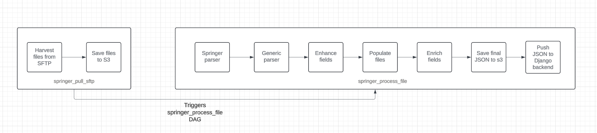

# Final fields

| Field                | Processed                                                                                                                         | Subfield     | Subsubfield    |
| -------------------- | --------------------------------------------------------------------------------------------------------------------------------- | ------------ | -------------- |
| dois                 | <a href="generic_parsing">generic_parsing</a> : <a href="#74">[74]</a>                                                            | value        |                |
| arxiv_eprints        | <a href="enricher">enricher</a> : <a href="#69">[69]</a>                                                                          | value        |                |
|                      |                                                                                                                                   | categories   |                |
| page_nr              | <a href="parsing">parsing</a> : <a href="#5">[5]</a>                                                                              |              |                |
| authors              | <a href="parsing">parsing</a> : <a href="#4">[4]</a>   <a href="generic_parsing">generic_parsing</a> : <a href="#40">[40]</a> | surname      |                |
|                      |                                                                                                                                   | given_names  |                |
|                      |                                                                                                                                   | full_name    |                |
|                      |                                                                                                                                   | affiliations | country        |
|                      |                                                                                                                                   |              | institution    |
| license              | <a href="parsing">parsing</a> : <a href="#20">[20]</a>                                                                            |              |                |
| collections          | <a href="generic_parsing">generic_parsing</a> : <a href="#42">[42]</a>                                                            |              |                |
| publication_info     | <a href="generic_parsing">generic_parsing</a> : <a href="#80">[80]</a>                                                            |              | journal_title  |
|                      |                                                                                                                                   |              | journal_volume |
|                      |                                                                                                                                   |              | year           |
|                      |                                                                                                                                   |              | journal_issue  |
|                      |                                                                                                                                   |              | artid          |
|                      |                                                                                                                                   |              | page_start     |
|                      |                                                                                                                                   |              | page_end       |
|                      |                                                                                                                                   |              | material       |
| abstracts            | <a href="generic_parsing">generic_parsing</a> : <a href="#74">[74]</a>                                                            | value        | journal_volume |
| acquisition_source   | <a href="enhancer">enhancer</a> : <a href="#48">[48]</a>                                                                          | source       |                |
|                      |                                                                                                                                   | method       |                |
|                      |                                                                                                                                   | date         |                |
| copyright            | <a href="enhancer">enhancer</a> : <a href="#49">[49]</a>                                                                          | holder       |                |
|                      |                                                                                                                                   | year         |                |
| record_creation_date | <a href="enricher">enricher</a> : <a href="#69">[69]</a>                                                                          |              |                |
| titles               | <a href="enhancer">enhancer</a> : <a href="#53">[53]</a>                                                                          | titles       |                |
|                      |                                                                                                                                   | source       |                |
| $schema              | <a href="enricher">enricher</a> : <a href="#68">[68]</a>                                                                          |              |                |

# [enricher](#enricher)

|                                               |               |                                                       |
| --------------------------------------------- | ------------- | ----------------------------------------------------- |
| Reference                                     | Field         | Enricher                                              |
| <a id="68" href="#68">
[68]
</a> | schema        | <a href="#_get_schema">\_get_schema</a>               |
| <a id="69" href="#69">
[69]
</a> | arxiv_eprints | <a href="#_get_arxiv_eprints">\_get_arxiv_eprints</a> |

### [\_get_schema](#_get_schema)

| Reference | Subfield | Value                                                                            | Default value |
| --------- | -------- | -------------------------------------------------------------------------------- | ------------- |
|           |          | <code>os.getenv("REPO_URL", "http://repo.qa.scoap3.org/schemas/hep.json")</code> |               |

### [\_get_arxiv_eprints](#_get_arxiv_eprints)

| Reference                      | Subfield   | Processing                                                                                                                                                                                                                                                                                                                                                                                                                                                  |
| ------------------------------ | ---------- | ----------------------------------------------------------------------------------------------------------------------------------------------------------------------------------------------------------------------------------------------------------------------------------------------------------------------------------------------------------------------------------------------------------------------------------------------------------- |
| <a id="90" href="#90">[90]</a> | categories | 1. Need to take arxiv id value from arxiv_eprints.value   2. Make a request to arxiv API: <code>f'https://export.arxiv.org/api/query?search_query=id:{arxiv_eprints.value}'</code>if:{ arxiv_eprints.value}'   3. From XML response, take the categories by path: arxiv:primary_category and rest of the categories by path: /w3:category.  xml_namespaces = { "arxiv": "http://arxiv.org/schemas/atom", "w3": "http://www.w3.org/2005/Atom", } |
| <a id="92" href="#92">[92]</a> | value      | Cleans blank space                                                                                                                                                                                                                                                                                                                                                                                                                                          |

# [enhancer](#enhancer)

| Reference                                     | Field                          | Enhancer                                                                           |
| --------------------------------------------- | ------------------------------ | ---------------------------------------------------------------------------------- |
| <a id="47" href="#47">
[47]
</a> | abstracts                      | <a href="#__construct_abstracts">\_\_construct_abstracts</a>                       |
| <a id="48" href="#48">
[48]
</a> | acquisition_source             | <a href="#__construct_acquisition_source">\_\_construct_acquisition_source</a>     |
| <a id="49" href="#49">
[49]
</a> | copyright                      | <a href="#__construct_copyright">\_\_construct_copyright</a>                       |
| <a id="50" href="#50">
[50]
</a> | imprints                       | <a href="#__construct_imprints">\_\_construct_imprints</a>                         |
| <a id="51" href="#51">
[51]
</a> | record_creation_date           | <a href="#__construct_record_creation_date">\_\_construct_record_creation_date</a> |
| <a id="52" href="#52">
[52]
</a> | titles                         | <a href="#__construct_titles">\_\_construct_titles</a>                             |
| <a id="53" href="#53">
[53]
</a> | authors.affiliations.countries | <a href="#__remove_country">\_\_remove_country</a>                                 |
|                                               |

### [\_\_construct_abstracts](#__construct_abstracts)

| Reference                      | Subfield | Value                                                                        |
| ------------------------------ | -------- | ---------------------------------------------------------------------------- |
| <a id="54" href="#54">[54]</a> | value    | Take value from <a href="#parsing">parsing</a> abstract <a href="#5">[5]</a> |
| <a id="55" href="#55">[55]</a> | source   | Constant: Springer                                                           |

### [\_\_construct_acquisition_source](#__construct_acquisition_source)

| Reference                      | Subfield | Value                                            |
| ------------------------------ | -------- | ------------------------------------------------ |
| <a id="56" href="#56">[56]</a> | source   | Constant: Springer                               |
| <a id="57" href="#57">[57]</a> | method   | Constant: Springer                               |
| <a id="58" href="#58">[58]</a> | date     | <code>datetime.datetime.now().isoformat()</code> |

### [\_\_construct_copyright](#__construct_copyright)

| Reference                      | Subfield  | Value                                                                                     |
| ------------------------------ | --------- | ----------------------------------------------------------------------------------------- |
| <a id="59" href="#59">[59]</a> | holder    | Take value from <a href="#parsing">parsing</a> copyright_holder <a href="#17">[17]</a>    |
| <a id="60" href="#60">[60]</a> | year      | Take value from <a href="#parsing">parsing</a> copyright_year <a href="#18">[18]</a>      |
| <a id="61" href="#61">[61]</a> | statement | Take value from <a href="#parsing">parsing</a> copyright_statement <a href="#19">[19]</a> |

### [\_\_construct_imprints](#__construct_imprints)

| Reference                      | Subfield  | Value                                                                                                |
| ------------------------------ | --------- | ---------------------------------------------------------------------------------------------------- |
| <a id="62" href="#62">[62]</a> | date      | Take value from <a href="#generic_parsing">generic_parsing</a> date_published <a href="#45">[45]</a> |
| <a id="63" href="#63">[63]</a> | publisher | constant: Springer                                                                                   |

### [\_\_construct_record_creation_date](#__construct_record_creation_date)

| Reference                      | Subfield | Value                                            |
| ------------------------------ | -------- | ------------------------------------------------ |
| <a id="64" href="#64">[64]</a> |          | <code>datetime.datetime.now().isoformat()</code> |

### [\_\_construct_titles](#__construct_titles)

| Reference                      | Subfield | Value                                                                                                |
| ------------------------------ | -------- | ---------------------------------------------------------------------------------------------------- |
| <a id="65" href="#65">[65]</a> | title    | removed fn tags. `FN_REGEX = re.compile(r"")`  `FN_REGEX.sub("", item.pop("title", "")).strip()` |
| <a id="66" href="#66">[66]</a> | source   | constant: Springer                                                                                   |

### [\_\_remove_country](#__remove_country)

|                                |                                                                                          |       |                                              |
| ------------------------------ | ---------------------------------------------------------------------------------------- | ----- | -------------------------------------------- |
| Reference                      | Field                                                                                    | Value | Processing                                   |
| <a id="67" href="#67">[67]</a> | from <a href="#parsing">parsed</a> json value: affiliations <a href="#31">31</a>.country |       | from parsed json value: affiliations.country |

# [generic_parsing](#generic_parsing)

| Reference                      | Field                  | Subfield  | Value                                                                                                                                                                                                                                                 | Default |
| ------------------------------ | ---------------------- | --------- | ----------------------------------------------------------------------------------------------------------------------------------------------------------------------------------------------------------------------------------------------------- | ------- |
| <a id="39" href="#39">[39]</a> | authors                | full_name | Joins <a href="#28" href="#28">surname</a> and <a href="#29" href="#29">give_names</a>: <code>"{0}, {1}".format(surname, given_names)</code>                                                                                                          |         |
| <a id="40" href="#40">[40]</a> | abstract               |           | Cleans white space chars.                                                                                                                                                                                                                             |         |
| <a id="41" href="#41">[41]</a> | collaborations         |           | Takes <a href="#parsing" href="#parsing">parsed<a> collaborations <a href="#8" href="#8">[8]</a> , cleans: <code>input.replace("for the", "")</code>, and removes white space chars                                                                   |         |
| <a id="42" href="#42">[42]</a> | collections            | primary   | Takes <a href="#parsing" href="#parsing">parsed<a> collections <a href="#21" href="#21">[21]<a>, puts the value in dict with key "primary": <code>[{"primary": collection} for collection in collections]</code>                                      |         |
| <a id="43" href="#43">[43]</a> | title                  |           | Takes <a href="#parsing" href="#parsing">parsed<a> title <a href="#6" href="#6">[6]</a> removes white spaces                                                                                                                                          |         |
| <a id="44" href="#44">[44]</a> | subtitle               |           | NO SUCH A FIELD IN SPRINGER                                                                                                                                                                                                                           |         |
| <a id="45" href="#45">[45]</a> | journal_year           |           | takes <a href="#parsing" href="#parsing">parsed</a> journal_year [15]                                                                                                                                                                                 |         |
| <a id="46" href="#46">[46]</a> | preprint_date          |           | NO SUCH A FIELD IN SPRINGER                                                                                                                                                                                                                           |         |
| <a id="70" href="#70">[70]</a> | date_published         |           | Takes <a href="#parsing" href="#parsing">parsed<a> date_published <a href="#16" href="#16">[16]</a>. If the date consists of two parts(for example: 2022-01), it will add the third number: 1, as a day. And then it will parse it to form YYYY-MM-DD |         |
| <a id="71" href="#71">[71]</a> | related_article_doi    |           | NO SUCH A FIELD IN SPRINGER                                                                                                                                                                                                                           |         |
| <a id="72" href="#72">[72]</a> | free_keywords          |           | NO SUCH A FIELD IN SPRINGER                                                                                                                                                                                                                           |         |
| <a id="73" href="#73">[73]</a> | classification_numbers |           | NO SUCH A FIELD IN SPRINGER                                                                                                                                                                                                                           |         |
| <a id="74" href="#74">[74]</a> | dois                   |           | Takes dois from(Parsing [1]) and puts every doi in dict   [{"value": doi} for doi in dois if doi]                                                                                                                                                 |         |
| <a id="75" href="#75">[75]</a> | thesis_supervisor      |           | NO SUCH A FIELD IN SPRINGER                                                                                                                                                                                                                           |         |
| <a id="76" href="#76">[76]</a> | urls                   |           | NO SUCH A FIELD IN SPRINGER                                                                                                                                                                                                                           |         |
| <a id="77" href="#77">[77]</a> | local_files            |           | NO SUCH A FIELD IN SPRINGER                                                                                                                                                                                                                           |         |
| <a id="78" href="#78">[78]</a> | record_creation_date   |           | NO SUCH A FIELD IN SPRINGER. Added just in enricher                                                                                                                                                                                                   |         |
| <a id="79" href="#79">[79]</a> | control_field          |           | NO SUCH A FIELD IN SPRINGER                                                                                                                                                                                                                           |         |
| <a id="80" href="#80">[80]</a> | publication_info       |           | <a href="#_get_publication_info">\_get_publication_info</a>                                                                                                                                                                                           |         |
|                                | journal_title          |           | REMOVED                                                                                                                                                                                                                                               |
|                                | journal_volume         |           | REMOVED                                                                                                                                                                                                                                               |
|                                | journal_year           |           | REMOVED                                                                                                                                                                                                                                               |
|                                | journal_issue          |           | REMOVED                                                                                                                                                                                                                                               |
|                                | journal_lpage          |           | REMOVED                                                                                                                                                                                                                                               |
|                                | journal_fpage          |           | REMOVED                                                                                                                                                                                                                                               |
|                                | journal_doctype        |           | REMOVED                                                                                                                                                                                                                                               |

### [\_get_publication_info](#_get_publication_info)

| Reference                      | Subfield         | Value                                                                                               | Default value |
| ------------------------------ | ---------------- | --------------------------------------------------------------------------------------------------- | ------------- |
| <a id="81" href="#81">[81]</a> | journal_title    | Takes <a href="#parsing" href="#parsing">parsed<a> journal_title <a href="#9" href="#9">[9]</a>     |               |
| <a id="82" href="#82">[82]</a> | journal_volume   | Takes <a href="#parsing" href="#parsing">parsed<a> journal_volume <a href="#11" href="#11">[11]</a> |               |
| <a id="83" href="#83">[83]</a> | year             | Takes <a href="#parsing" href="#parsing">parsed<a> journal_year <a href="#15" href="#15">[15]</a>   | 0             |
| <a id="84" href="#84">[84]</a> | journal_issue    | Takes <a href="#parsing" href="#parsing">parsed<a> journal_issue <a href="#10" href="#10">[10]</a>  |               |
| <a id="85" href="#85">[85]</a> | artid            | Takes <a href="#parsing" href="#parsing">parsed<a> journal_artid <a href="#12" href="#12">[12]</a>  |               |
| <a id="86" href="#86">[86]</a> | page_start       | Takes <a href="#parsing" href="#parsing">parsed<a> journal_fpage <a href="#13" href="#13">[13]</a>  |               |
| <a id="87" href="#87">[87]</a> | page_end         | Takes <a href="#parsing" href="#parsing">parsed<a> journal_lpage <a href="#14" href="#14">[14]</a>  |               |
| <a id="88" href="#88">[88]</a> | material         | Takes <a href="#parsing" href="#parsing">parsed<a> journal_doctype <a href="#2" href="#2">[2]</a>   |               |
| <a id="89" href="#89">[89]</a> | pubinfo_freetext | NO SUCH A FIELD IN SPRINGER                                                                         |

# [parsing](#parsing)

| Reference                      | Field               | Required | Method  | Source                                                                                                                                                                                                                                 | Parsing                                                                                                                                                                                             |
| ------------------------------ | ------------------- | -------- | ------- | -------------------------------------------------------------------------------------------------------------------------------------------------------------------------------------------------------------------------------------- | --------------------------------------------------------------------------------------------------------------------------------------------------------------------------------------------------- |
| <a id="1" href="#1">[1]</a>    | dois                | True     | find    | path: ./Journal/Volume/Issue/Article/ArticleInfo/ArticleDOI                                                                                                                                                                            |                                                                                                                                                                                                     |
| <a id="2" href="#2">[2]</a>    | journal_doctype     | False    | find    | path: ./Journal/Volume/Issue/Article/ArticleInfo   attribute: ArticleType                                                                                                                                                          | <a href="#_get_journal_doctype">\_get_journal_doctype</a>                                                                                                                                           |
| <a id="3" href="#3">[3]</a>    | arxiv_eprints       | False    | findall | path: ./Journal/Volume/Issue/Article/ArticleInfo/ArticleExternalID[@Type='arXiv']                                                                                                                                                      | <code>lambda x: {"value": x}</code>                                                                                                                                                                 |
| <a id="4" href="#4">[4]</a>    | page_nr             | False    | find    | path (first page): ./Journal/Volume/Issue/Article/ArticleInfo/ArticleFirstPage   path (last page): ./Journal/Volume/Issue/Article/ArticleInfo/ArticleLastPage                                                                      | <code>[int(last_page_node) - int(first_page_node) + 1]</code>                                                                                                                                       |
| <a id="5" href="#5">[5]</a>    | abstract            | True     | find    | path: ./Journal/Volume/Issue/Article/ArticleHeader/Abstract/Para                                                                                                                                                                       | Filter values from paragraph: takes just those which don't have tag"EquationSource" or attribute["Format"]== "TEX". Later joins all filtered values to a single string and removes >1 blank spaces. |
| <a id="6" href="#6">[6]</a>    | title               | True     | find    | path: ./Journal/JournalInfo/JournalTitle                                                                                                                                                                                               | <code>lambda x: [x.lstrip("The ")]</code>                                                                                                                                                           |
| <a id="7" href="#7">[7]</a>    | authors             | True     |         |                                                                                                                                                                                                                                        | <a href="_get_authors">\_get_authors</a>                                                                                                                                                            |
| <a id="8" href="#8">[8]</a>    | collaborations      | False    | find    | path: ./Journal/Volume/Issue/Article/ArticleHeader/AuthorGroup/InstitutionalAuthor/InstitutionalAuthorName                                                                                                                             |                                                                                                                                                                                                     |
| <a id="9" href="#9">[9]</a>    | journal_title       | True     | find    | path: ./Journal/JournalInfo/JournalTitle                                                                                                                                                                                               | <code>lambda x: [x.lstrip("The ")]</code>                                                                                                                                                           |
| <a id="10" href="#10">[10]</a> | journal_issue       | False    | find    | path: ./Journal/Volume/Issue/IssueInfo/IssueIDStart                                                                                                                                                                                    |                                                                                                                                                                                                     |
| <a id="11" href="#11">[11]</a> | journal_volume      | False    | find    | path: ./Journal/Volume/VolumeInfo/VolumeIDStart                                                                                                                                                                                        |                                                                                                                                                                                                     |
| <a id="12" href="#12">[12]</a> | journal_artid       | False    | find    | path: ./Journal/Volume/Issue/Article   attribute: ID                                                                                                                                                                               |                                                                                                                                                                                                     |
| <a id="13" href="#13">[13]</a> | journal_fpage       | True ?   | find    | path: ./Journal/Volume/Issue/Article/ArticleInfo/ArticleFirstPage                                                                                                                                                                      |                                                                                                                                                                                                     |
| <a id="14" href="#14">[14]</a> | journal_lpage       | True ?   | find    | path: ./Journal/Volume/Issue/Article/ArticleInfo/ArticleLastPage                                                                                                                                                                       |                                                                                                                                                                                                     |
| <a id="15" href="#15">[15]</a> | journal_year        | True ?   | find    | path: ./Journal/Volume/Issue/Article/ArticleInfo/\*/OnlineDate/Year                                                                                                                                                                    |                                                                                                                                                                                                     |
| <a id="16" href="#16">[16]</a> | date_published      | False    | find    | path(year): /Journal/Volume/Issue/Article/ArticleInfo/_/OnlineDate/Year   path(month): ./Journal/Volume/Issue/Article/ArticleInfo/_/OnlineDate/Month   path(day): ./Journal/Volume/Issue/Article/ArticleInfo/\*/OnlineDate/Day | <code>datetime.date(day=int(day), month=int(month), year=int(year)).isoformat()</code>                                                                                                              |
| <a id="17" href="#17">[17]</a> | copyright_year      | True ?   | find    | path: ./Journal/Volume/Issue/Article/ArticleInfo/\*/OnlineDate/Year                                                                                                                                                                    | <code>lambda x: int(x)</code>                                                                                                                                                                       |
| <a id="18" href="#18">[18]</a> | copyright_statement | False    | find    | path: ./Journal/Volume/Issue/Article/ArticleInfo/ArticleCopyright/copyright-statement                                                                                                                                                  |                                                                                                                                                                                                     |
| <a id="19" href="#19">[19]</a> | copyright_holder    | True ?   | find    | path: ./Journal/Volume/Issue/Article/ArticleInfo/ArticleCopyright/CopyrightHolderName                                                                                                                                                  |                                                                                                                                                                                                     |
| <a id="20" href="#20">[20]</a> | license             | False ?  | find    |                                                                                                                                                                                                                                        | <a href="#_get_license">\_get_license</a>                                                                                                                                                           |
| <a id="21" href="#21">[21]</a> | collections         | True     |         | path: ./Journal/JournalInfo/JournalTitle                                                                                                                                                                                               | <code>lambda x: [x.lstrip("The ")]</code>                                                                                                                                                           |

### [\_get_authors](#_get_authors)

| Reference                      | Field        | Tag path                                                 | Method | Attribute                                                                                                                                                     | Processing |
| ------------------------------ | ------------ | -------------------------------------------------------- | ------ | ------------------------------------------------------------------------------------------------------------------------------------------------------------- | ---------- |
| <a id="27" href="#27">[27]</a> | orcid        | .                                                        | find   | ORCID                                                                                                                                                         |            |
| <a id="28" href="#28">[28]</a> | surname      | ./AuthorName/FamilyName                                  | find   |                                                                                                                                                               |            |
| <a id="29" href="#29">[29]</a> | given_names  | ./AuthorName/GivenName                                   | find   |                                                                                                                                                               |            |
| <a id="30" href="#30">[30]</a> | email        | ./Contact/Email                                          | find   |                                                                                                                                                               |            |
| <a id="31" href="#31">[31]</a> | affiliations | ./Journal/Volume/Issue/Article/ArticleHeader/AuthorGroup | find   | AuthorGroup and later takes each group separately by path: `./Affiliation[@ID='{affiation_id}']` and then <a href="#_get_affiliations">\_get_affiliations</a> |            |

### [\_get_affiliations](#_get_affiliations)

|     | Field        | Tag path                                                                                                                                                           | Method | Attribute | Processing |
| --- | ------------ | ------------------------------------------------------------------------------------------------------------------------------------------------------------------ | ------ | --------- | ---------- |
|     | value        | Join all existing values from: `./OrgDivision, ./OrgName, ./OrgAddress/Street, ./OrgAddress/City, ./OrgAddress/State, ./OrgAddress/Postcode, ./OrgAddress/Country` | find   |           |            |
|     | organization | ./OrgDivision                                                                                                                                                      | find   |           |            |
|     | country      | ./OrgAddress/Country                                                                                                                                               | find   |           |            |

### [\_get_published_date](#_get_published_date)

| Reference                      | Value       | Method | Tag path                                                       | Processing                                                                   |
| ------------------------------ | ----------- | ------ | -------------------------------------------------------------- | ---------------------------------------------------------------------------- |
| <a id="67" href="#67">[67]</a> | year        | find   | ./Journal/Volume/Issue/Article/ArticleInfo/\*/OnlineDate/Year  |                                                                              |
| <a id="32" href="#32">[32]</a> | month       | find   | ./Journal/Volume/Issue/Article/ArticleInfo/\*/OnlineDate/Month |                                                                              |
| <a id="33" href="#33">[33]</a> | day         | find   | ./Journal/Volume/Issue/Article/ArticleInfo/\*/OnlineDate/Day   |                                                                              |
| <a id="34" href="#34">[34]</a> | FINAL VALUE |        |                                                                | ` datetime.date(day=int(day), month=int(month), year=int(year)).isoformat()` |

### [\_get_license](#_get_license)

| Reference                      | Field   | Method  | Path                                                                                    | Processing                                                                                                                                                                                                                                             | Default value                               |
| ------------------------------ | ------- | ------- | --------------------------------------------------------------------------------------- | ------------------------------------------------------------------------------------------------------------------------------------------------------------------------------------------------------------------------------------------------------ | ------------------------------------------- |
| <a id="35" href="#35">[35]</a> | license | findall | path(license_node): ./Journal/Volume/Issue/Article/ArticleInfo/ArticleCopyright/License | <code>license_type_parts = license_node.get("SubType").split(" ")</code> <code>license_type = "-".join(license_type_parts)</code> <code>version = version_node.get("Version")</code> <code>FINAL VALUE: f"{license_type}-{version}"</code> | CC-BY-3.0                                   |
| <a id="36" href="#36">[36]</a> | url     | find    |                                                                                         | Base url: <code>https://creativecommons.org/licenses</code> <code>f"{base_url}/{license_type_parts[1].lower()}/{version}"</code>                                                                                                                   | https://creativecommons.org/licenses/by/3.0 |

### [\_get_journal_doctype](#_get_journal_doctype)

| Field | Processing                                                                                                                                                                                                                                                                                                                                                                                                                                                                                                                                                                         |
| ----- | ---------------------------------------------------------------------------------------------------------------------------------------------------------------------------------------------------------------------------------------------------------------------------------------------------------------------------------------------------------------------------------------------------------------------------------------------------------------------------------------------------------------------------------------------------------------------------------- |
|       | Takes the value found by path and attribute. Maps the value from mapping:   <code> {"OriginalPaper": "article","ReviewPaper": "review","BriefCommunication": "article","EditorialNotes": "editorial","BookReview": "review","ContinuingEducation": "other","Interview": "other","Letter": "other","Erratum": "erratum","Legacy": "other","Abstract": "other","Report": "other","Announcement": "other","News": "other","Events": "other","Acknowledgments": "other","MediaReport": "other","BibliographicalNote": "other","ProductNotes": "other","Unknown": "other", }</code> |
