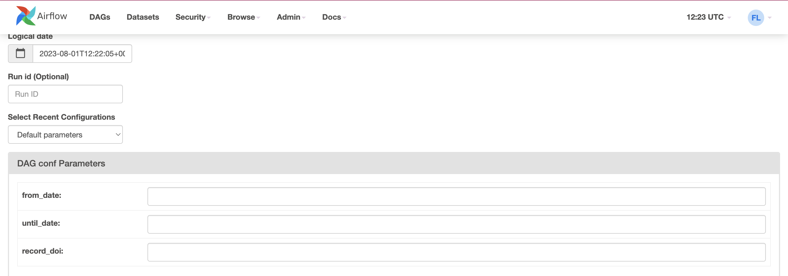
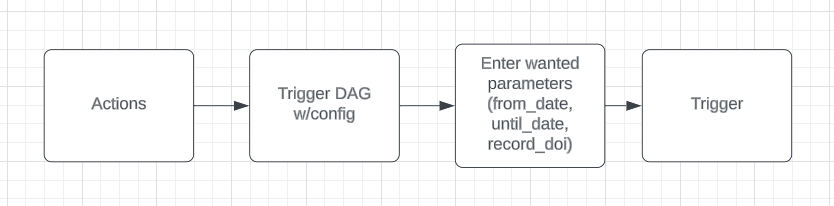

# APS

## Default Running Parameters

1. APS Harvester Customize Parameters:

| Parameter  | Description                                            | Default Value                                                                                                                              |
| ---------- | ------------------------------------------------------ | ------------------------------------------------------------------------------------------------------------------------------------------ |
| from_date  | Format: YYYY-MM-DD<br>Modification date of the article | `from_date ? from_date : the_date_of_last_uploaded_file`<br>`the_date_of_last_uploaded_file ? the_date_of_last_uploaded_file : until_date` |
| until_date | Format: YYYY-MM-DD<br>Modification date of the article | `until_date ? until_date : the_date_of_today`                                                                                              |
| record_doi | The specific article's DOI we want to request          | none                                                                                                                                       |

2. To run a DAG with customized parameters (`from_date`, `until_date`, `record_doi`), there are two methods:

- By using the UI and setting the desired values:
  

- Running a DAG using the API:
  - POST: `api/v1/dags/aps_pull_api/dagRuns`
  - Header: `{Content-Type : application/json, Accept : application/json}`
  - Body:
    ```json
    {
      "dag_run_id": "my_first_run",
      "logical_date": "2023-07-24T14:15:22Z",
      "execution_date": "2023-07-24T14:15:22Z",
      "conf": { "from_date": "2023-01-01", "until_date": "2023-02-01" },
      "note": "string"
    }
    ```
  - Curl Example:
    ```bash
    curl -X POST -H "Content-Type: application/json" -d '{
        "dag_run_id": "my_first_run_3",
        "logical_date": "2023-08-01T12:56:22Z",
        "execution_date": "2023-08-01T12:56:22Z",
        "conf": {"from_date": "2023-01-01", "until_date": "2023-02-01"},
        "note": "string"
    }' --user "admin:admin" http://localhost:8080/api/v1/dags/aps_pull_api/dagRuns
    ```

3. Trigger a DAG Run from UI:

- With default values:
  

- With custom values:
  
